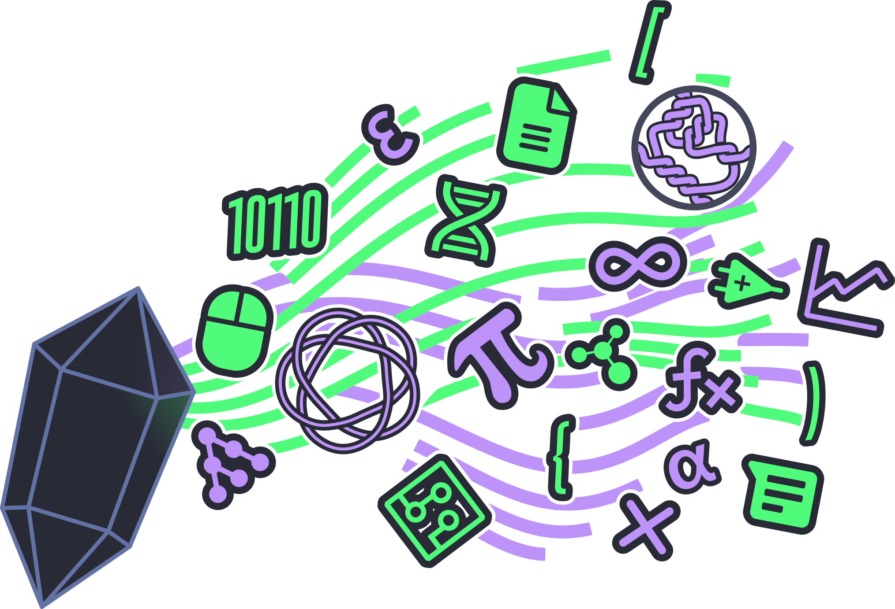
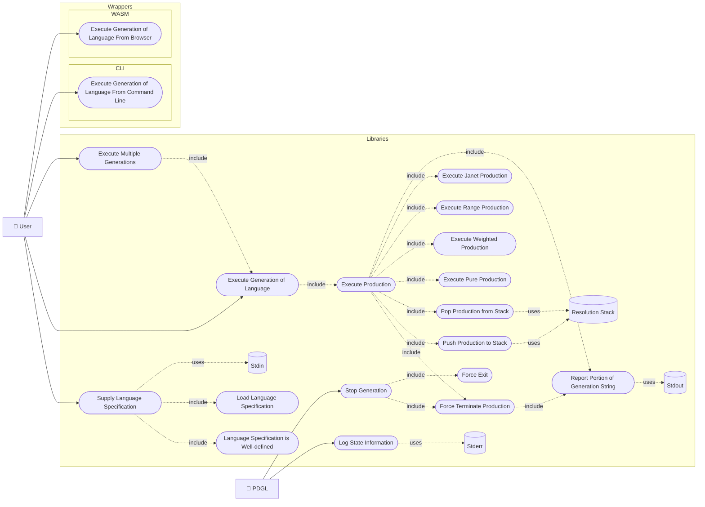

[](https://doi.org/10.5281/zenodo.18962752)
[](https://www.gnu.org/licenses/gpl-3.0)

[](https://brainmade.org)


## Note to Reader

The following document as well as the [Documentation](./lib_docs.md) and
[Code Comments](./lib/files/) pages are intended for developers. A user who doesn't intend to
contribute to development might find the [User Guide](./manual/whatis/) page more helpful.

If you discover an issue with this repository or have a question, please feel free to open an issue.
I've included templates for the following issues:

- 🖋️ Spelling and Grammar: Found some language that is incorrect?
- 🤷 Clarity: Found a section that just makes no sense?
- ❓ Question: Do you have a general question?
- 🐞 Bug: Found an error in the code?
- 🚀 Enhancement: Have a suggestion for improving the toolchain?

[:fontawesome-solid-paper-plane: Open Issue!](https://github.com/Joecstarr/pdgl/issues/new/choose){ .md-button }

## 📃 Cite Me

BibTeX and APA on the right sidebar of GitHub.

## ⚖️ License

GNU GPL v3

## Planning and Administration

### Tasks

Tasks are tracked as GitHub issues, each `Enhancement` and `Bug` generating the following collection
of issues and child issues:

- A primary issue describing the goal:
  - A documentation child issue.
  - An implementation child issue.
  - A validation child issue.

### Version control

The toolchain shall be kept under Git versioning. Development shall take place on branches with
`main` on GitHub as a source of truth. GitHub pull requests shall serve as the arbiter for inclusion
on main with the following quality gates:

- Compiling of source code.
- Running and passing the unit test suite.
- Running and passing linting and style enforcers.
- Successful generation of documentation.

#### Release Tagging

The project shall be tagged when an `Enhancement` or `Bug` issue is merged into main. The tag shall
follow [semantic versioning](https://semver.org) for labels.

```text
vMAJOR.MINOR.PATCH
```

### Project Structure

```text


📁 .
├── 📁 docs
│   └── 📄 README.md
├── 📁 libraries
│   ├── 📁 <libraries> 
│   ├── 🛠️ CMakeLists.txt 
│   └── 📄 Findlizard  
├── 📁 languages 
│   └── <language definitions>  
├── 📁 source
│   └── 📁 <library> 
│       ├── 📁 test
│       │   ├── 🇨test_<>.c 
│       │   └── 🛠️ CMakeLists.txt 
│       ├── 📁src
│       │   ├── 🇨<>.c 
│       │   └── 🇭<>.h
│       ├── 📁 docs
│       │   ├── 📁 media
│       │   ├── 📄 index.md 
│       │   └── 📄 unit-description.md 
│       ├── 🛠️ CMakeLists.txt 
│       └── 📄 mkdocs.yml
├── 📁 wrappers 
│   └── 📁 <wrapper> 
│       ├── 📁 test
│       │   ├── 🇨test_<>.c 
│       │   └── 🛠️ CMakeLists.txt 
│       ├── 📁src
│       │   ├── 🇨<>.c 
│       │   └── 🇭<>.h
│       ├── 📁 docs
│       │   ├── 📁 media
│       │   ├── 📄 index.md 
│       │   └── 📄 unit-description.md 
│       ├── 🛠️ CMakeLists.txt 
│       └── 📄 mkdocs.yml
├── 📄 CITATION
├── 🛠️ CMakeLists.txt
├── ❄️ flake.lock
├── ❄️ flake.nix
├── 📄 Justfile
├── 📄 LICENSE
├── 📄 mkdocs.yml
└── 🐍 requirements.txt
```

### Directories of Interest

- Source: This directory contains the C libraries for the PDGL.
- Wrappers: This directory contains the C executable wrappers for the PDGL.
- Docs: This directory contains the high level documentation for the PDGL.
- Languages: This directory contains language definitions for the PDGL.

### Define a Unit

A unit in this project shall be defined as a header file for a C library module.

### Quality

The PDGL and its units shall fail-safe, that is the PDGL and its units can fail, but the failure
must be detectable.

#### Unit Testing

Each C module shall be unit tested. Lower level components may or may not be mocked for higher level
components.

#### Integration Testing

No integration test is expected for the library code. Integration tests are expected to be carried
out by wrappers.

#### Requirements

The PDGL reimplements portions of the original DGL by Maurer [@maurerDGLVersion22024] (source is
available on [Dr. Maurer's personal website](https://cs.baylor.edu/~maurer/dgl.php) and mirrored on
[GitHub](https://github.com/Uiowa-Applied-Topology/dgl_v1_mirror)). The original DGL consumes a
language definition for a grammar (usually context free) and produces a compilable `.c` source file.
This workflow is a little cumbersome in practice. The PDGL intends to implement a set of portable
libraries that consume a language definition and directly produce words of that language. To that
end the PDGL shall match the features and use cases of the original DGL where possible. Some
features may be hard or impossible to reproduce with a modular design. The PDGL shall forgo the
`DGL` language itself in favor of definitions of languages in `TOML`.

##### DGL Vs. PDGL Feature Matrix

| Symbol                                       | Support Level   |
| -------------------------------------------- | --------------- |
| <i class="fa-solid fa-star"></i>             | Full Support    |
| <i class="fa-solid fa-star-half-stroke"></i> | Partial Support |
| <i class="fa-solid fa-hourglass-start"></i>  | Support Planned |
| <i class="fa-solid fa-x"></i>                | Unsupported     |

| DGL Production Type                  |                                               Support                                               | PDGL Production Type or Implementation Difficulty                                                                                          |
| ------------------------------------ | :-------------------------------------------------------------------------------------------------: | :----------------------------------------------------------------------------------------------------------------------------------------- |
| "Unweighted production"              |                                  <i class="fa-solid fa-star"></i>                                   | [Pure Production][prod_pure]                                                                                                               |
| "Weighted production"                |                                  <i class="fa-solid fa-star"></i>                                   | [Weighted Production][prod_weighted]                                                                                                       |
| "Character Range production `[a-z]`" | <i class="fa-solid fa-star-half-stroke"></i><br>Can be reproduced with a list in a pure production. | [Pure Production][prod_pure]                                                                                                               |
| "Arithmetic Productions"             |                                    <i class="fa-solid fa-x"></i>                                    | Hard for native arithmetic productions, as modeling the storage of a global variable is a pain point that requires thought.                |
| action                               |             <i class="fa-solid fa-star-half-stroke"></i><br>PDGL doesn't maintain state             | [Janet Production][prod_janet] Adding the ability to maintain state of a production is easy. Having state be scoped to a language is hard. |
| range                                |                                    <i class="fa-solid fa-x"></i>                                    | [Range Production][prod_range]                                                                                                             |
| counter                              |                                    <i class="fa-solid fa-x"></i>                                    | Easy, some care to be taken in the termination case.                                                                                       |
| unique                               |                                    <i class="fa-solid fa-x"></i>                                    | Easy, some care to be taken in the overflow and termination case.                                                                          |
| chain                                |                                    <i class="fa-solid fa-x"></i>                                    | Hard, I can't see how to do this without a language scope state context.                                                                   |
| double                               |                                    <i class="fa-solid fa-x"></i>                                    | Easy, straight forward extension of a range production.                                                                                    |
| permutation                          |                                    <i class="fa-solid fa-x"></i>                                    | Hard, I can't see how to do this without a language scope state context.                                                                   |
| sequence                             |                                    <i class="fa-solid fa-x"></i>                                    | Easy, straight forward extension of a pure production.                                                                                     |

##### Functional Requirements

###### Use Cases

Functional requirements for the toolchain are phrased as use cases. The following use case diagram
models the interdependence of those use cases.



**Phase 1:**

- [Execute Multiple Generations](use-cases/execute_multiple_generations.md)
- [Execute Generation of Language](use-cases/execute_generation_of_language.md)
- [Execute Production](use-cases/execute_production.md)
- [Report Portion of Generation String](use-cases/report_portion_of_generation_string.md)
- [Push Production to Stack](use-cases/push_production_to_stack.md)
- [Pop Production from Stack](use-cases/pop_production_from_stack.md)
- [Execute Pure Production](use-cases/execute_pure_production.md)
- [Execute Janet Production](use-cases/execute_janet_production.md)
- [Execute Range Production](use-cases/execute_range_production.md)
- [Execute Weighted Production](use-cases/execute_weighted_production.md)
- [Supply Language Specification](use-cases/supply_language_specification.md)
- [Load Language Specification](use-cases/load_language_specification.md)
- [Language Specification is Well-defined](use-cases/language_specification_is_welldefined.md)
- [Stop Generation](use-cases/stop_generation.md)
- [Force Exit](use-cases/force_exit.md)
- [Force Terminate Production](use-cases/force_terminate_production.md)

**Phase 2:**

- [Log State Information](use-cases/log_state_information.md)

##### Architectural Decisions

For the PDGL libraries the use cases should be sufficient to motivate and document behavior. When
this is insufficient to document specific architectural decisions a collection of [MADR][@Kopp2018]
(<https://github.com/adr/madr>) should be used to document the decisions.

Wrappers may reference system use cases and define their use cases. However, [MADR][@Kopp2018]
(<https://github.com/adr/madr>) should serve as the primary documentation for the architecture of a
wrapper.

#### Nonfunctional Requirements

##### Colors

Diagrams included in documentation for features (use case and unit descriptions) are expected to use
the [COLORS](https://clrs.cc) color palette.

##### Technologies

###### Languages and Frameworks

The PDGL and its components shall be written in C using clang for compiling and CMake as a build
system. By design the entry point shall be decoupled from core functionality. These are expected to
be compilable with various tooling including C/C++, Python, and JavaScript. This requires all
'external' interfaces to be C++ linkable.

Unit testing of runnable and data wrangler libraries will use the
[Unity](http://www.throwtheswitch.org/unity) and [CMock](http://www.throwtheswitch.org/cmock)
libraries for unit testing. Test indexing is handled by
[CTest](https://cmake.org/cmake/help/latest/module/CTest.html).

**Tools**:

- git
- mermaid.js
- Unity
- clang
- CMake
- CTest
- Doxygen
- CMock
- Python
- mkdocs
- Pytest
- prek
- valgrind
- tombi
- uncrustify
- rumdl
- MADR[@Kopp2018]

###### Documentation of Implementation

C/C++ code is documented with [Doxygen](https://www.doxygen.nl/), the Doxygen comments shall be
parsed and output as XML. General documentation shall be recorded as Markdown files in each module's
monorepo. Documentation shall be aggregated using the [mkdoxy](https://mkdoxy.kubaandrysek.cz/)
framework.

###### Code Style Guide

The C/C++ code in this repository shall be formatted by the bundled uncrustify configuration.
