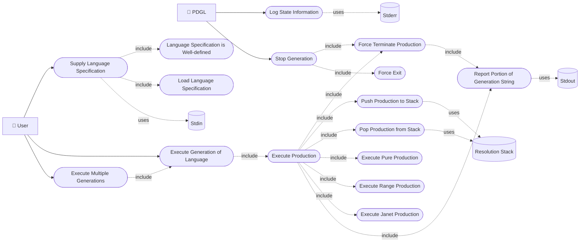

# Portable Generation Language Based on Probabilistic Context Free Grammars


[](https://www.gnu.org/licenses/gpl-3.0)

## Note to Reader

If you discover an issue with this repository or have a question, please feel free to open an issue.
I've included templates for the following issues:

- 🖋️ Spelling and Grammar: Found some language that is incorrect?
- 🤷 Clarity: Found a section that just makes no sense?
- ❓ Question: Do you have a general question?
- 🐞 Bug: Found an error in the code?
- 🚀 Enhancement: Have a suggestion for improving the toolchain?

## 📃 Cite Me

BibTeX and APA on the right sidebar of GitHub.

## ⚖️ License

GNU GPL v3

## Planning and Administration

### Tasks

Tasks are tracked as GitHub issues, each `Enhancement` and `Bug` generating the following collection
of issues and child issues:

- A primary issue describing the goal:
    - A documentation child issue.
    - An implementation child issue.
    - A validation child issue.

### Version control

The generator toolchain shall be kept under Git versioning. Development shall take place on branches
with `main` on GitHub as a source of truth. GitHub pull requests shall serve as the arbiter for
inclusion on main with the following quality gates:

- Compiling of source code.
- Running of and passing unit test suite.
- Running and passing linting and style enforcers.
- Successful generation of documentation.

#### Release Tagging

The project shall be tagged when an `Enhancement` or `Bug` issue is merged into main. The tag shall
follow [semantic versioning](https://semver.org) for labels.

```
vMAJOR.MINOR.PATCH
```

### Project Structure

```


📁 .
├── 📁 docs
│   └── 📄 README.md
├── 📁 libraries
│   └── 📄 Findlizard  
├── 📁 languages 
│   └── <language definitions>  
├── 📁 source
│   └── 📁 <library> 
│       ├── 📁 test
│       │   ├── 🇨test_<>.c 
│       │   └── 🛠️ CMakeLists.txt 
│       ├── 📁src
│       │   ├── 🇨<>.c 
│       │   └── 🇭<>.h
│       ├── 📁 docs
│       │   ├── 📁 media
│       │   ├── 📄 index.md 
│       │   └── 📄 unit-description.md 
│       ├── 🛠️ CMakeLists.txt 
│       └── 📄 mkdocs.yml
├── 📄 CITATION
├── 🛠️ CMakeLists.txt
├── ❄️ flake.lock
├── ❄️ flake.nix
├── 📄 Justfile
├── 📄 LICENSE
├── 📄 mkdocs.yml
├── 🐍 requirements.txt
└── 📄 ruff.toml
```

#### Directories of interest

- Source: This directory contains the C libraries for the pdgl.
- Docs: This directory contains the high level documentation for the pdgl.
- Languages: This directory contains language definitions for the pdgl.

### Define a unit

A unit in this project shall be defined as a header file for a C library module.

### Quality

The pdgl and its units shall fail safe, that is the pdgl and its units can fail but the failure must
be detectable.

#### Unit testing

Each C module shall be unit tested. Lower level components may or may not be mocked for higher level
components.

#### Integration testing

No integration test is expected. Integration tests are expected to be carried out by wrappers.

### Requirements

The pdgl reimplements portions of the original dgl by Maurer [@maurerDGLVersion22024] (source is
available on [Dr. Maurer's personal website](https://cs.baylor.edu/~maurer/dgl.php) and mirrored on
[GitHub](https://github.com/Uiowa-Applied-Topology/dgl_v1_mirror)). The original dgl consumes a
language definition for a context free grammar and produces a compilable `.c` source file. This
workflow is a little cumbersome in practice. The pdgl intends to implement a single portable library
that consumes a language definition and directly probabilistically generates words of that language.
To that end the pdgl shall match the features and use cases of the original dgl. The pdgl however
shall forgo the `dgl` language itself in favor of definitions of languages in `toml` strings.

#### Functional Requirements

##### Use Cases

Functional requirements for the toolchain are phrased as use cases which can be seen in the sidebar.
The following use case diagram models the interdependence of those use cases.



- [Execute Multiple Generations](use-cases/execute_multiple_generations.md)
- [Execute Generation of Language](use-cases/execute_generation_of_language.md)
- [Execute Production](use-cases/execute_production.md)
- [Report Portion of Generation String](use-cases/report_portion_of_generation_string.md)
- [Push Production to Stack](use-cases/push_production_to_stack.md)
- [Pop Production from Stack](use-cases/pop_production_from_stack.md)
- [Execute Pure Production](use-cases/execute_pure_production.md)
- [Execute Janet Production](use-cases/execute_janet_production.md)
- [Execute Range Production](use-cases/execute_range_production.md)
- [Supply Language Specification](use-cases/supply_language_specification.md)
- [Load Language Specification](use-cases/load_language_specification.md)
- [Language Specification is Well-defined](use-cases/language_specification_is_welldefined.md)
- [Log State Information](use-cases/log_state_information.md)
- [Stop Generation](use-cases/stop_generation.md)
- [Force Exit](use-cases/force_exit.md)
- [Force Terminate Production](use-cases/force_terminate_production.md)

### Non-Functional Requirements

Not applicable.

## Technologies

### Languages and Frameworks

The runnable and data wrangler libraries will be written in C/C++ using clang for compiling and
cmake as a build system. The runners are written with various tooling including C/C++, Python, and
JavaScript.

Unit testing of runnable and data wrangler libraries will use the
[Unity](http://www.throwtheswitch.org/unity) and [Cmock](http://www.throwtheswitch.org/cmock)
libraries for unit testing. Test indexing is handled by
[CTest](https://cmake.org/cmake/help/latest/module/CTest.html).

#### Code Style Guide

The C/C++ code in this repository shall be formatted by the bundled uncrustify configuration.

### Tools

- git
- mermaid.js
- Unity
- clang
- cmake
- CTest
- Doxygen
- Cmock
- Python
- sphinx
- Pytest
- prek
- uncrustify
- mdformat

## Design and Documentation

C/C++ code is documented with [Doxygen](https://www.doxygen.nl/), the Doxygen comments shall be
parsed and output as XML. General documentation shall be recorded as markdown files in each module's
directory. Documentation shall be aggregated using the
[Sphinx](https://www.sphinx-doc.org/en/master/) framework. Sphinx shall then use
[Breathe](https://github.com/breathe-doc/breathe) to parse Doxygen XML into the general
documentation.

### Colors

Diagrams included in documentation for features (use case and unit descriptions) are expected to use
the [COLORS](https://clrs.cc) color palette.
