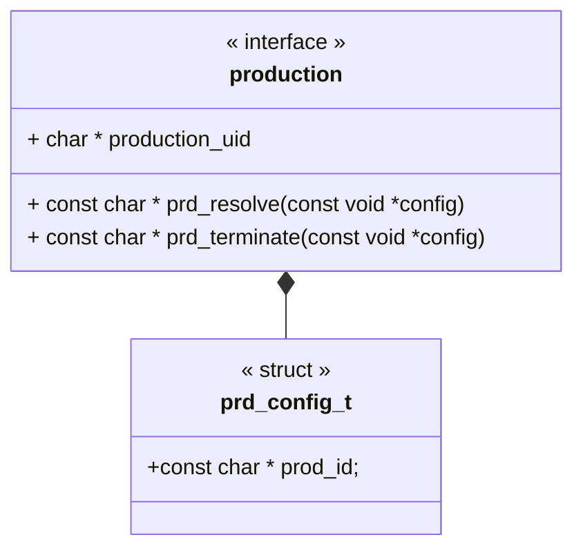
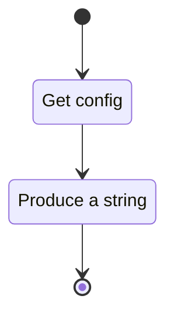

# Unit Description

## Functionality

### Public Structures

#### Production Configuration Structure

The production configuration structure defines the collection of data the component needs for an
'instance'. A configuration should be considered equivalent to instantiating a class in a high-level
language. This instance needs to contain all state information needed for that class.

### Public Functions

#### Resolve Function

When this function is invoked, the production process begins. The actual internal functionality is
specific to the specific production. The function returns the string resulting from the production.
In the case of a failure a NULL pointer is returned.

The flow for a production is modeled by the following state machine:

#### Terminate Function

When this function is invoked, the production executes a special terminal case. The actual internal
functionality is specific to the specific production. The function returns the string resulting from
the termination. In the case of a failure a NULL pointer is returned.

The flow for a production termination is modeled by the following state machine:

A special termination case allows for production of 'truncated' words in a language when constraints
are exceeded. The default termination is the empty string.

