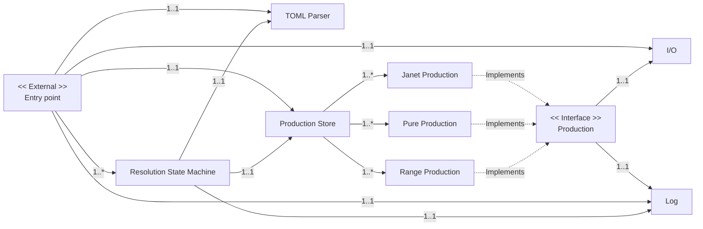

## System Architecture

## General Design Considerations

##### Memory

The PDGL is to be written in C, one major consideration when using a non-memory language like C is
memory leaks. The allocation (and release) of memory at runtime is complicated and error prone. To
mitigate the risk of a memory leak we will restrict runtime memory allocation where possible.
Instead we will allocate memory at runtime or opt for passing of buffers.

##### Patterns

We will leverage the [strategy](https://refactoring.guru/design-patterns/strategy) pattern for
defining generic productions with the interface described as the
[Production Interface](./interfaces/production.md). We will also leverage the
[prototype](https://refactoring.guru/design-patterns/prototype) pattern for managing configurations
of various 'objects'. Meaning components should not maintain internal state, any state must be
passed to components.
