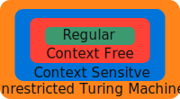

[](){#what-prelim}

## What Is a Formal Language?

What do you think of when you think of a language? The first things that probably come to mind are
spoken languages like Spanish or English. While these are interesting objects of study, in math and
computer science their loose structure causes issues. Instead, we take these common ideas and
distill them into their essential components. We give them well defined formal structures; we call
these distillations formal languages. The basic building blocks of a [language][pre-def-lang] are
[words][pre-def-words]. Each word of a language is in turn built from an [alphabet][pre-def-alph] of
symbols.

[](){#pre-def-alph}

> [!definition] "Definition: An Alphabet (from Hopcroft, Motwani, and Ullman
> [@hopcroftIntroductionAutomataTheory2007] )"
>
> An **alphabet** $\Sigma$ is a finite nonempty set of symbols.

[](){#pre-def-words}

> [!definition] "Definition: A Word (paraphrasing Hopcroft, Motwani, and Ullman
> [@hopcroftIntroductionAutomataTheory2007] )"
>
> A **word** is a finite ordered sequence $\LS a_i\RS_{i=0}^n$ where each $a_i$ is in $\Sigma$.
> Further, we denote the collection of all words of an alphabet with $\Sigma^\ast$.

[](){#pre-def-emptword}

> [!definition] "Definition: The Empty Word (paraphrasing Hopcroft, Motwani, and Ullman
> [@hopcroftIntroductionAutomataTheory2007] )"
>
> A word of an alphabet containing no symbols is called the **empty word**, denoted $\varepsilon$.

[](){#pre-def-lang}

> [!definition] "Definition: A Language (paraphrasing Hopcroft, Motwani, and Ullman
> [@hopcroftIntroductionAutomataTheory2007] )"
>
> A **language** over an alphabet is a set $L\subset \Sigma^\ast$.

Returning to our Spanish example. If we allow for some imprecision, we may formalize Spanish as:

- $\Sigma$: The set of all Spanish dictionary words
- $\Sigma^\ast$: The set of sequences of Spanish dictionary words
- $L$: The set of sequences of Spanish dictionary words that form a sentence.

> [!sat] "Stop and Think:"
>
> Through the lens of formalization we can analyze a considerable number of objects. What are some
> other examples of a formal language? Particularly can you think of any that are not spoken
> languages?

## What Is a Grammar?

Given a formal language over an alphabet and any word built from that alphabet, the most basic
question that we can ask is:

> Is this word in this language?

For languages with little structure, this question is difficult. However, for languages that have
what is called a grammar, answering the question becomes easier. Imprecisely, a grammar for a formal
language is a set of rules that describe how words of the language can be "legally" formed. For
example, consider the formal language of complete English sentences over the alphabet of English
dictionary words. This language comes equipped with the grammar we all learned in grade school,
which requires that a word to contain at least one subject and predicate. In formal practice
grammars come in several flavors, each flavor has definition criteria and characteristics. In fact,
formal grammars comprise a [hierarchy][fig-higher] that is (imprecisely) based on the maximum
"complexity" for words in the language. Of interest to the PDGL and its use are the context free
grammars.

[](){#fig-higher} 

/// caption
The hierarchy of grammars[^chom], information on the other "flavors" can be found in Hopcroft, Motwani, and Ullman [@hopcroftIntroductionAutomataTheory2007] as well as many other sources.
///

[](){#subsec-context_free}
### What Is a Context Free Grammar?

A context free grammar is built from the following ingredients:

1. An alphabet for the language, called terminals.
1. A second alphabet of temporary symbols distinct from the alphabet. We call these symbols
   variables.
1. A starting variable.
1. A set of maps that we call productions. Each production in the set eats a variable and maps to a
   string. The derived strings are made of terminals and variables in any combination we desire.
   Maps are written $V\to W$ where $V$ is a variable and $W$ is an output string.

[](){#def-grammar}

> [!definition] "Paraphrasing Sipser Definition 2.2 [@sipserIntroductionTheoryComputation2013]"
>
> A 4-tuple $( V, \Sigma, R, S )$, where
>
> 1. $V$ is a finite set called the variables.
> 1. $\Sigma$ is a finite set, disjoint from $V$, called the terminals.
> 1. $R$ is a finite set of rules (productions), with each rule being a map from a variable to a
>    string of variables and terminals.
> 1. $S\in V$ is the start variable.
>
> is called a **context free grammar**.

> [!Note] ""
>
> A note on national convention, when multiple productions in the set of rules map from the same
> variable, we condense those maps to a single line with a $|$ symbol separating resulting strings.
> This condensation process is seen here:
>
> ```math
> \begin{matrix}
> \begin{aligned}V&\to W_1\\V&\to W_2\end{aligned} &\Rightarrow & V\to W_1 \mid  W_2
> \end{matrix}
> ```

A common example given for a context free grammar is the paired parentheses grammar. In this
language each word is an arrangement of the alphabet symbols $($ and $)$ where each $($ has a paired
closing $)$.

[](){#ex-paired_paren}

> [!example] "Taken from Sipser Example 2.3 [@sipserIntroductionTheoryComputation2013]"
>
> The context free grammar:
>
> 1. $V=\LS S\RS$.
> 1. $\Sigma=\LS (,),\varepsilon\RS$.
> 1. $R$ is the set
>     - $S\to (S) \mid SS \mid \varepsilon$
> 1. $S=S$
>
> A sample of words of this language are:
>
> - (())
> - ()()
> - ((()()))

When a language can be described by a context free grammar answering the question

> Is this word in this language?

for a word is as simple as checking for productions that lead to the word. Specifically, starting
with the start variable. Demonstrate there is at least one sequence of productions from $R$ that
result in the desired word.

[](){#ex-der_paired_paren}

> [!example] "Example:"
>
> In the paired parentheses grammar we can verify $()(())()$ to be in the language by the sequence
> of productions given in the table below.
>
> | Current string | Next production to resolve on leftmost variable |
> | -------------- | ----------------------------------------------- |
> | $S$            | $S\to SS$                                       |
> | $SS$           | $S\to SS$                                       |
> | $SSS$          | $S\to (S)$                                      |
> | $(S)SS$        | $S\to \varepsilon$                              |
> | $()SS$         | $S\to (S)$                                      |
> | $()(S)S$       | $S\to (S)$                                      |
> | $()((S))S$     | $S\to (S)$                                      |
> | $()((S))S$     | $S\to \varepsilon$                              |
> | $()(())S$      | $S\to (S)$                                      |
> | $()(())(S)$    | $S\to \varepsilon$                              |
> | $()(())()$     |                                                 |
>
> Note how the resolution of productions behaves like a stack, first in last out.

We call the resulting language of words fitting the productions a **context free language**.

[ Next $\to$](../what){ .md-button }

[^chom]: I think it is important to note this is usually called the "Chomsky Hierarchy". I've
    elected a different name based on ongoing
    [controversy](https://en.wikipedia.org/wiki/Noam_Chomsky#Friendship_with_Jeffrey_Epstein).
