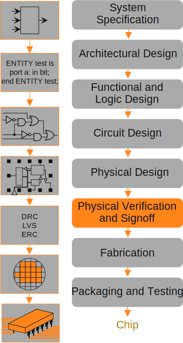

At this point we know what the PDGL does, deriving a sample of words from a grammar. What we will
see here are some examples of why/when this sampling process is useful. The common thread you should
notice in these examples is that the PDGL creates large datasets with understanding and control of
the space being sampled. During software validation or when undertaking research experimentation
this can serve to create lightly or heavily tailored datasets.

> [!warning] "Warning:"
>
> I'm not an electrical/computer engineer or a biologist. Meaning I don't design logic circuits from
> gates and I don't work in a wet lab. I have a surface level understanding of processes in these
> domains. I will give here the story as I understand it, if you find something inactuate let me
> know.
>
> [:fontawesome-solid-paper-plane: Open Issue!](https://github.com/Joecstarr/pdgl/issues/new/choose){ .md-button }

## Validation of Circuit Design in the Very-Large-Scale Integration (VLSI) Process

You probably don't think very much about the fact that your life revolves around rocks. I mean
that's caveman stuff right? Granted the rocks we depend on look a lot different from an arrowhead or
handaxe. If you're reading this on a computer of some sort you're actively using fancy rocks(I hope
you aren't printing out web pages... it's bad for the environment and makes clicking buttons a lot
harder). The integrated circuits (ICs) you're using are essentially rocks that we shot with a laser
to turn into logic systems.

Unfortunately, just walking into your yard, picking up a piece of quartz, and shooting it with a
laser won't magically create an IC. Instead, production of an IC, particularly complex ICs, requires
carrying out a complex [multistep development process][fig-circuit] called Very-Large-Scale
Integration (VLSI).

<!-- rumdl-capture -->
<!-- rumdl-disable * -->
{#fig-circuit}  
///caption 
An overview of the IC design process[^cd]. 
///
<!-- rumdl-restore -->

Consider how complicated the process of IC creation is and how are critical they are to our lives.
Every day when we press the brake pedal in our car we trust in the reliability of ICs. That
reliability comes in part from IC verification processes (orange in the
[figure above](#fig-circuit)). The level of complexity in the VLSI process is extremely high, at
this level abstracting test cases becomes easier than direct creation. This abstraction can take the
form of a grammar whose words are test cases. As discussed by Maurer [@maurerDGLVersion22024] this
verification abstraction process is one of the motivating applications for the original DGL.

## Sampling RNA:DNA Hybrids

> [!under-construction] "Under Construction:"
>
> See paper by Jonoska, Obatake, Poznanovic, Price, Riehl, and Vazquez [@jonoskaModelingRNADNA2021].

[^cd]: Remix of <a href="https://commons.wikimedia.org/wiki/File:PhysicalDesign.svg">Linear77 </a>,
<a href="https://creativecommons.org/licenses/by/3.0">CC BY 3.0 </a>, via Wikimedia Commons
