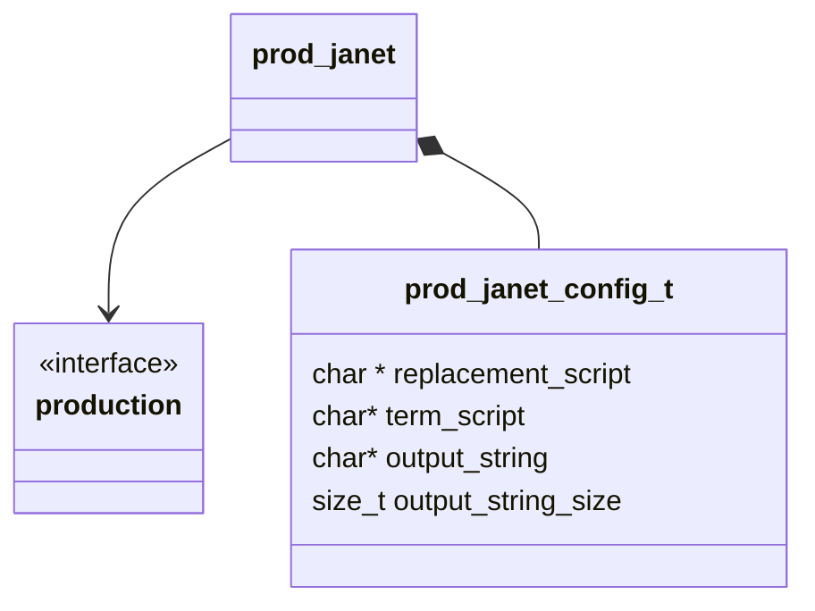
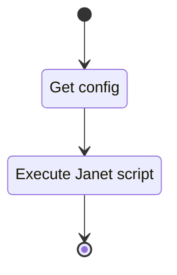

## Class Diagram

## Interfaces

- [Production][prod_inter]

## Libraries

- [Janet Lib](https://github.com/janet-lang/janet)

## Functionality

### Public Structures

#### Configuration Structure

The configuration structure for the pure production includes the data needed for a basic string
replacement production.

This includes:

- A pointer to replacement script C string.
- A pointer to terminal script C string.
- A pointer to a C string buffer used for output.
- The length of the output buffer.

### Public Functions

#### Resolve Function

The resolution function executes the replacement Janet script contained in the configuration
returning the printed value to the calling routine.

#### Terminate Function

The terminate function executes the terminal Janet script contained in the configuration returning
the printed value to the calling routine.

## Validation

### Resolve Function

#### Positive Tests

> [!test-card] "A valid configuration is passed to the function"
>
> A valid configuration for the production is passed to the function.
>
> **Inputs:**
>
> - A valid configuration
>
> **Expected Output:**
>
> A positive response, with the one of the correct strings.

#### Negative Tests

> [!test-card] "Bad Configuration"
>
> A null configuration for the computation is passed to the function.
>
> **Inputs:**
>
> - A null configuration.
> - A null replacement script
> - A null output string
> - A zero length output string
>
> **Expected Output:**
>
> A negative response.

### Terminal Function

#### Positive Tests

> [!test-card] "A valid configuration is passed to the function"
>
> A valid configuration for the production is passed to the function.
>
> **Inputs:**
>
> - A valid configuration
>
> **Expected Output:**
>
> A positive response, with the one of the correct strings.

#### Negative Tests

> [!test-card] "Bad Configuration"
>
> A null configuration for the computation is passed to the function.
>
> **Inputs:**
>
> - A null configuration.
> - A null terminal script
> - A null output string
> - A zero length output string
>
> **Expected Output:**
>
> A negative response.
