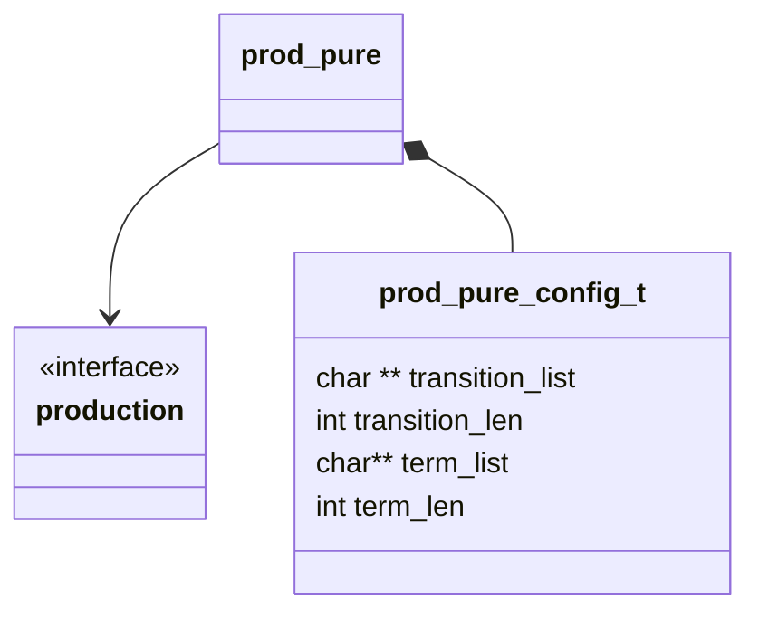

## Class Diagram

## Interfaces

- [Production][prod_inter]

## Libraries

None

## Functionality

### Public Structures

#### Configuration Structure

The configuration structure for the pure production includes the data needed for a basic string
replacement production.

This includes:

- A pointer to a list of pointers to transition strings.
- The number of transition strings.
- A pointer to a list of pointers to terminal strings.
- The number of terminal strings.

### Public Functions

#### Resolve Function

The resolve function for the pure production follows the basic production flow. Randomly selecting
one of the transition strings from the list of transitions.

#### Terminate Function

The terminate function for the pure production follows the basic production flow. Randomly selecting
one of the terminal strings from the list of terminals.

## Validation
