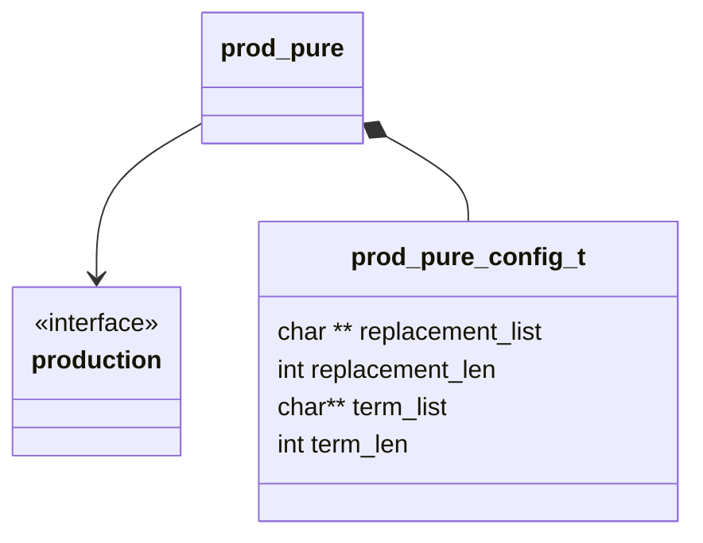

## Class Diagram

## Interfaces

- [Production][prod_inter]

## Libraries

None

## Functionality

### Public Structures

#### Configuration Structure

The configuration structure for the pure production includes the data needed for a basic string
replacement production.

This includes:

- A pointer to a list of pointers to replacement strings.
- The number of replacement strings.
- A pointer to a list of pointers to terminal strings.
- The number of terminal strings.

### Public Functions

#### Resolve Function

The resolve function for the pure production follows the basic production flow. Randomly selecting
one of the replacement strings from the list of replacements.

#### Terminate Function

The terminate function for the pure production follows the basic production flow. Randomly selecting
one of the terminal strings from the list of terminals.

## Validation

### Resolve Function

#### Positive Tests

> [!test-card] "A valid configuration is passed to the function"
>
> A valid configuration for the production is passed to the function.
>
> **Inputs:**
>
> - A valid configuration
>
> **Expected Output:**
>
> A positive response, with the one of the correct strings.

#### Negative Tests

> [!test-card] "Bad Configuration"
>
> A null configuration for the computation is passed to the function.
>
> **Inputs:**
>
> - A null configuration.
> - A null replacement list
> - A zero length replacement list
>
> **Expected Output:**
>
> A negative response.

### Terminal Function

#### Positive Tests

> [!test-card] "A valid configuration is passed to the function"
>
> A valid configuration for the production is passed to the function.
>
> **Inputs:**
>
> - A valid configuration
>
> **Expected Output:**
>
> A positive response, with the one of the correct strings.

#### Negative Tests

> [!test-card] "Bad Configuration"
>
> A null configuration for the computation is passed to the function.
>
> **Inputs:**
>
> - A null configuration.
> - A null terminal list
> - A zero length terminal list
>
> **Expected Output:**
>
> A negative response.
