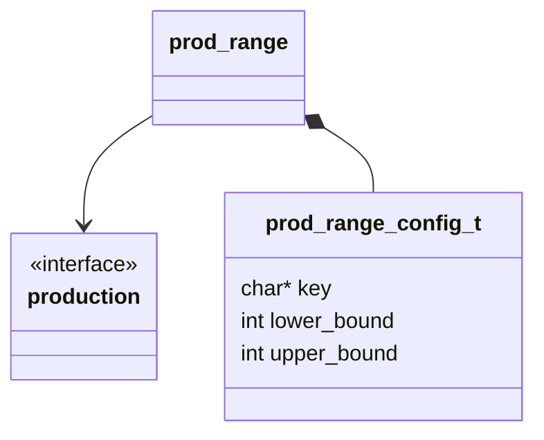
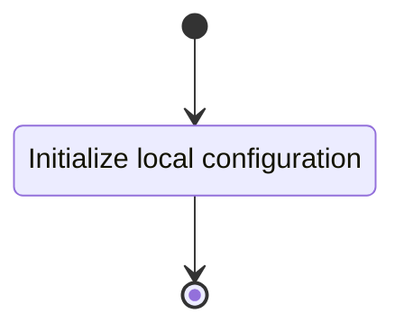

## Class Diagram

## Interfaces

- [Production][prod_inter]

## Libraries

None

## Functionality

### Public Structures

#### Configuration Structure

The configuration structure contains the data needed for computing the positivity of an input WPTT.

This includes:

- A pointer to a read-only notation structure for a WPTT.

### Public Functions

#### Function

The configuration function sets the local configuration variable of the computation.

This process is described in the following state machines:

## Validation
