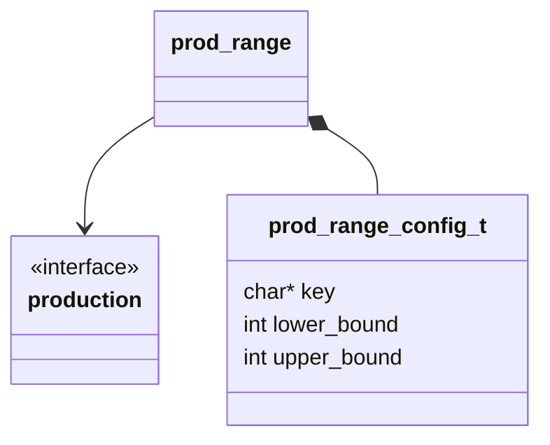
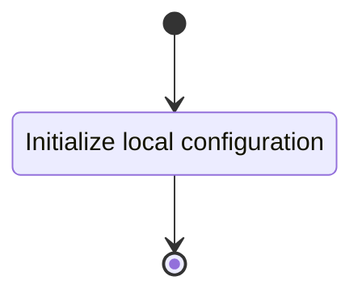

## Class Diagram

## Interfaces

- [Production][prod_inter]

## Libraries

None

## Functionality

### Public Structures

#### Configuration Structure

The configuration structure contains the data needed for computing the positivity of an input WPTT.

This includes:

- A pointer to a read-only notation structure for a WPTT.

### Public Functions

#### Function

The configuration function sets the local configuration variable of the computation.

This process is described in the following state machines:

## Validation

### Resolve Function

#### Positive Tests

!!! test-card "Valid Configuration"

    A valid configuration for the production is passed to the function.

    **Inputs:**

    - A valid configuration with:
        - Upper == Lower
        - Lower $<$ Upper

    **Expected Output:**

    A positive response and correct string.

#### Negative Tests

!!! test-card "Bad Configuration"

    An invalid configuration for the production is passed to the function.

    **Inputs:**

    - A null string.
    - Upper $<$ Lower

    **Expected Output:**

    A negative response.

!!! test-card "Null Configuration"

    A null configuration for the production is passed to the function.

    **Inputs:**

    - A null configuration

    **Expected Output:**

    A negative response.

### Terminate Function

The terminate function calls the resolve function directly
