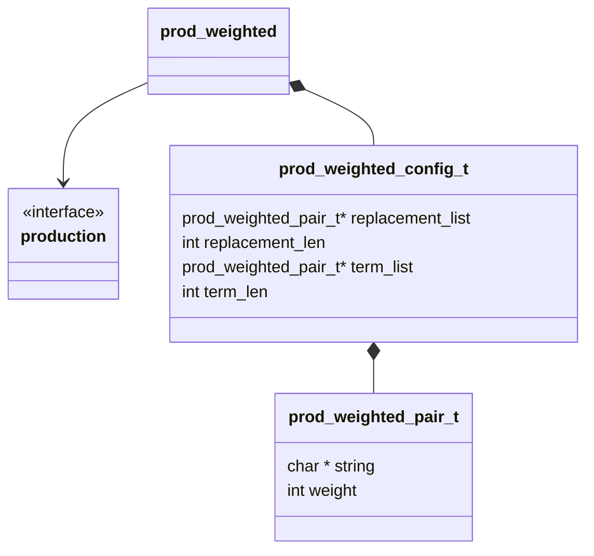

## Class Diagram

## Interfaces

- [Production][prod_inter]

## Libraries

None

## Functionality

### Public Structures

#### Configuration Structure

The configuration structure for the weighted production includes all the data needed for a basic
string replacement production as well as a weight for each configured string.

This includes:

- A pointer to a list of pointers to replacement strings and weights.
- The number of replacement strings and weights.
- A pointer to a list of pointers to terminal strings and weights.
- The number of terminal strings and weights.

### Public Functions

#### Resolve Function

The resolve function for the weighted production essentially follows the basic production flow. The
only difference is a string is randomly selected based on its weighting.

For a list of string weight pairs $\LS \LP s_i, w_i\RP\RS_i^n $, the weighted selection of a string
is accomplished by simulating an array of length $\Sigma w_i$. In the simulated array each string
$s_i$ is represented $w_i$ times.

#### Terminate Function

The terminate function for the weighted production essentially follows the basic production flow.
The only difference is a string is randomly selected based on its weighting.

For a list of string weight pairs $\LS \LP s_i, w_i\RP\RS_i^n $, the weighted selection of a string
is accomplished by simulating an array of length $\Sigma w_i$. In the simulated array each string
$s_i$ is represented $w_i$ times.

## Validation

### Resolve Function

#### Positive Tests

> [!test-card] "A valid configuration is passed to the function"
>
> A valid configuration for the production is passed to the function.
>
> **Inputs:**
>
> - A valid configuration:
>   - 2 strings one with weight 1 and one with weight 2
>   - 1 string with weight 1
>
> **Expected Output:**
>
> A positive response, with the strings in the correct ratio.

#### Negative Tests

> [!test-card] "Bad Configuration"
>
> A null configuration for the computation is passed to the function.
>
> **Inputs:**
>
> - A null configuration.
> - A null replacement list.
> - A zero length replacement list.
> - Weights whose sum overflows an uint64.
>
> **Expected Output:**
>
> A negative response.

### Terminal Function

#### Positive Tests

> [!test-card] "A valid configuration is passed to the function"
>
> A valid configuration for the production is passed to the function.
>
> **Inputs:**
>
> - A valid configuration:
>   - 2 strings one with weight 1 and one with weight 2
>   - 1 string with weight 1
>
> **Expected Output:**
>
> A positive response, with the strings in the correct ratio.

#### Negative Tests

> [!test-card] "Bad Configuration"
>
> A null configuration for the computation is passed to the function.
>
> **Inputs:**
>
> - A null configuration.
> - A null terminal list.
> - A zero length terminal list.
> - Weights whose sum overflows an uint64.
>
> **Expected Output:**
>
> A negative response.
