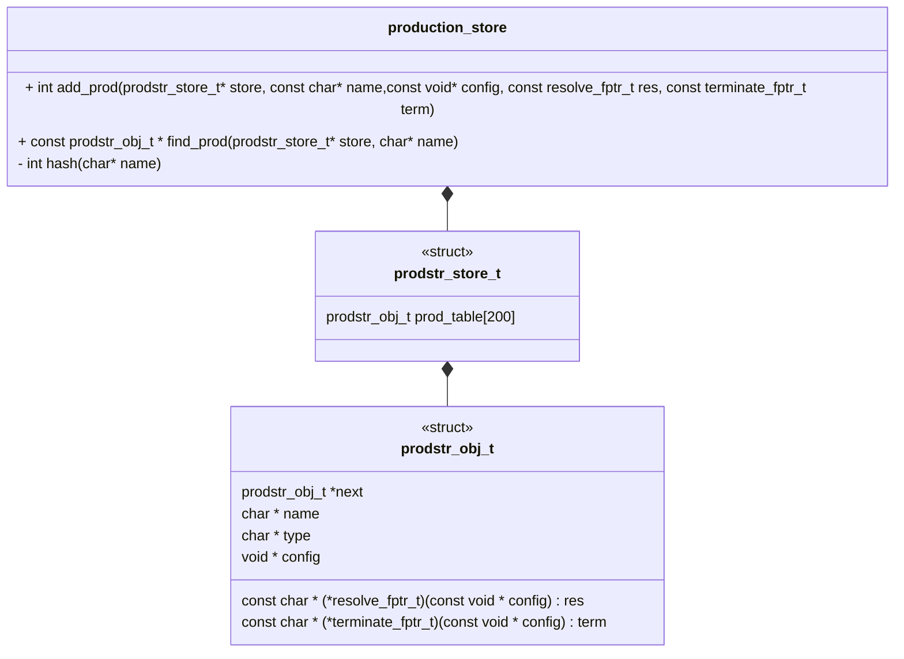
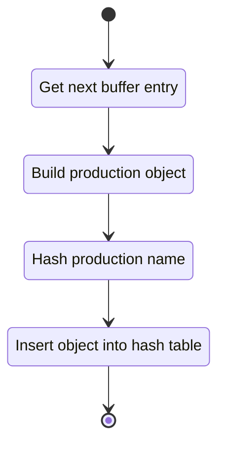
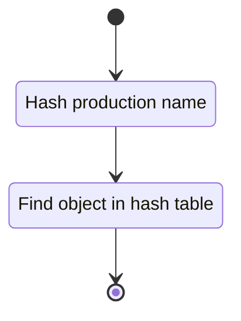

## Class Diagram

## Libraries

None

## Functionality

### Public Structures

#### Production Store Structure

The production store holds a hash table of production objects. This requires:

- A buffer of production objects.
- A hash table of production objects.

#### Production Object Buffer Structure

The buffer structure of production objects.

#### Production Store Object Structure

The production object type holds a single production object. To ensure hash collisions are not a
problem each object holds a pointer to another object in the same hash bin. Otherwise this structure
contains:

- The name of the production. This serves as the key for the hash.
- A void pointer to a production configuration. We choose void to allow storage of arbitrary
  production types.
- A function pointer to the resolve function of the production.
- A function pointer to the terminate function of the production.

### Public Functions

#### Add Production Function

The function adds a production to the supplied hash table. The function takes the data required for
to produce a production object. The function returns a status indicator.

This process is described in the following state machines:

#### Get Production Function

The function retrieves a production from the supplied hash table. The function returns the requested
production or NULL in the error case.

This process is described in the following state machines:

## Validation

### Add Function

#### Positive Tests

!!! test-card "A production is passed to the add function"

    A production is passed to the add function.

    **Inputs:**

    - A production is passed to the add function with an empty store.
    - A production is passed to the add function with a non-empty stores:
        - The store has a value away from the hash of the supplied production
        - The store has a value at the hash of the supplied production

    **Expected Output:**

    A positive response. The store is reflecting an additional element. New element is at the correct
    hash and matches the supplied production.

#### Negative Tests

!!! test-card "A production already in the store is passed to the store"

    A production already in the store is passed back to the store.

    **Inputs:**

    - A production and store with collision.

    **Expected Output:**

    A negative response.

!!! test-card "A NULL pointer is passed to the function"

    A NULL pointer is passed to the function.

    **Inputs:**

    - A null pointer for:
        - store
        - production

    **Expected Output:**

    A negative response.

### Find Function

#### Positive Tests

!!! test-card "A production key is passed to the find function"

    A production key is passed to the find function.

    **Inputs:**

    - A valid production which is:
        - In the store.
        - Not in the store.

    **Expected Output:**

    - A matching production.
    - A null pointer.

#### Negative Tests

!!! test-card "A NULL pointer is passed to the function"

    A NULL pointer is passed to the function.

    **Inputs:**

    - A null pointer for:
        - store
        - production key

    **Expected Output:**

    A negative response.
