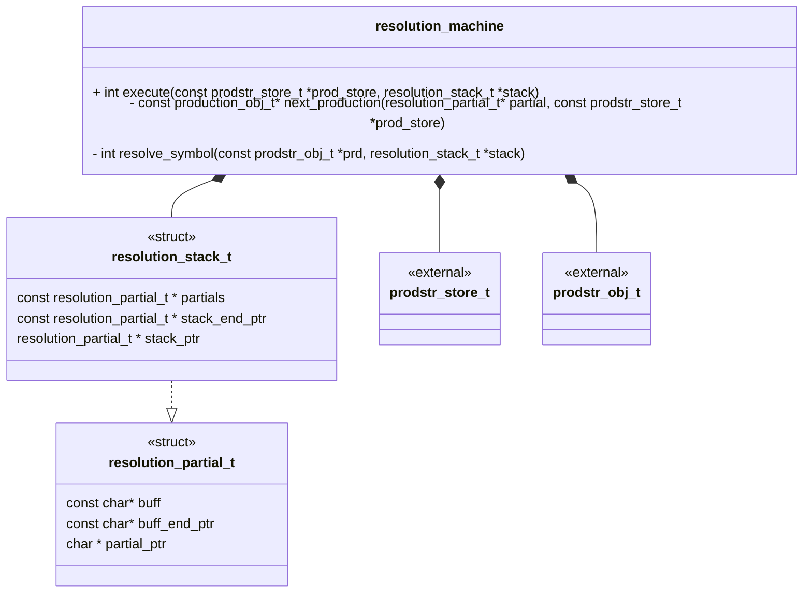
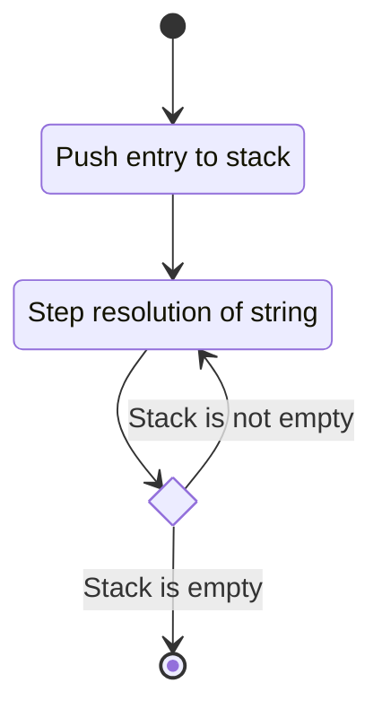
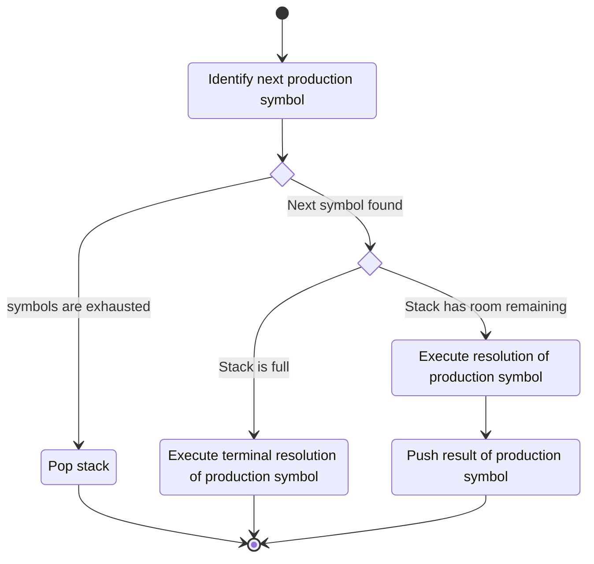
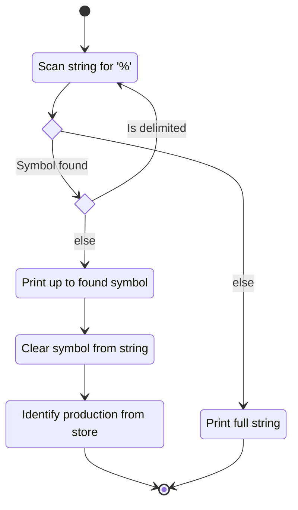

## Class Diagram

## Libraries

None

## Use Cases Satisfied

- [Execute Multiple Generations][execute_multiple_generations]
- [Execute Generation of Language][execute_generation_of_language]
- [Execute Production][execute_production]
- [Report Portion of Generation String][report_portion_of_generation_string]
- [Push Production to Stack][push_production_to_stack]
- [Pop Production from Stack][pop_production_from_stack]

## Functionality

### Public Structures

#### Partial Buffer Structure

The buffer structure for partial resolutions. The buffer contains a start, end, and current pointer
for the block of memory. This is essentially a c-string.

#### Resolution Stack Structure

A stack of partial resolution objects. The stack contains a start, end, and current pointer for the
block of memory.

### Public Functions

#### Execute Function

This process is described in the following state machines:

### Private Functions

## Validation
