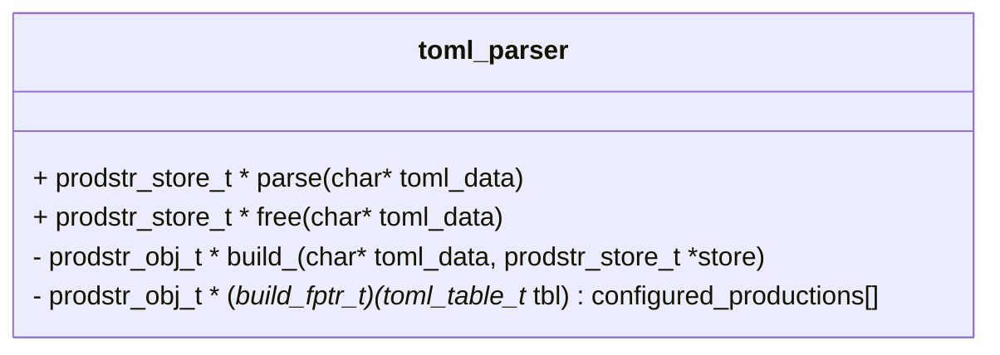
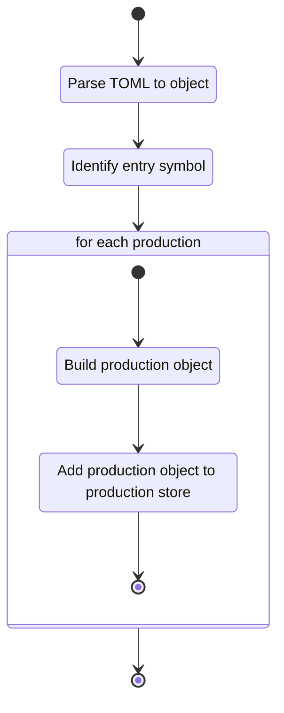

## Class Diagram

## Libraries

- [tomlc17](https://github.com/cktan/tomlc17)

## Use Cases Satisfied

- [Supply Language Specification][supply_language_specification]
- [Load Language Specification][load_language_specification]
- [Language Specification is Well-defined][language_specification_is_welldefined]

## Functionality

### Public Structures

The module contains no public structures.

### Public Functions

#### Parse Function

The parse function takes TOML data passed to the module and from that data constructs a production
store and identifies the entry symbol.

This process is described in the following state machines:

### Private Functions

#### Build `<<production>>` Functions

The build `<<production>>` functions take data from the given TOML and parses it into a specific
flavor of production object for storage. The implementation of each of these functions is unique and
should be documented in Doxygen comments at declaration.

## Validation
