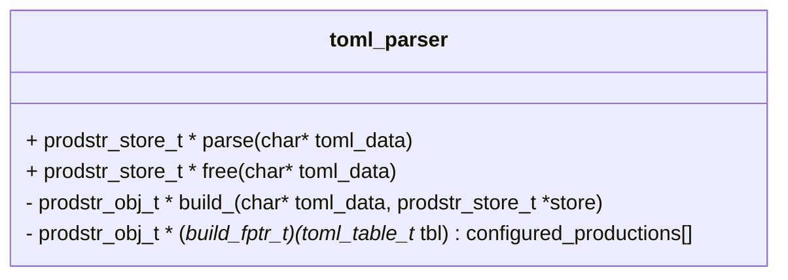
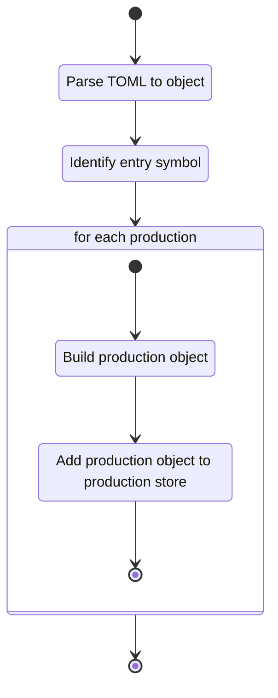

## Class Diagram

## Libraries

- [tomlc17](https://github.com/cktan/tomlc17)

## Use Cases Satisfied

- [Supply Language Specification][supply_language_specification]
- [Load Language Specification][load_language_specification]
- [Language Specification is Well-defined][language_specification_is_welldefined]

## Functionality

### Public Structures

The module contains no public structures.

### Public Functions

#### Parse Function

The parse function takes TOML data passed to the module and from that data constructs a production
store and identifies the entry symbol.

This process is described in the following state machines:

### Private Functions

#### Build `<<production>>` Functions

The build `<<production>>` functions take data from the given TOML and parses it into a specific
flavor of production object for storage. The implementation of each of these functions is unique and
should be documented in Doxygen comments at declaration.

## Validation

### Parsing Function

#### Positive Tests

> [!test-card] "Valid TOML"
>
> A TOML string is passed to the parsing routine. The string contains one each of the registered
> production types.
>
> **Inputs:**
>
> - A TOML string with valid.
>
> **Expected Output:**
>
> - A production store is produced matching the configuration.

#### Negative Tests

> [!test-card] "Malformed TOML is supplied"
>
> A malformed TOML string is passed to the parsing routine. The routine exits with an error state.
>
> **Inputs:**
>
> - A malformed TOML string.
>
> **Expected Output:**
>
> - A NULL ptr is returned.

> [!test-card] "NULL TOML string is supplied"
>
> A NULL pointer is supplied as the TOML string is passed to the parsing routine. The routine exits
> with an error state.
>
> **Inputs:**
>
> - A NULL pointer TOML string.
>
> **Expected Output:**
>
> - A NULL ptr is returned.

> [!test-card] "Configuration with invalid pure production"
>
> A TOML string is passed to the parsing routine with invalid pure production specified.
>
> **Inputs:**
>
> - The following configurations of TOML:
>     - Missing terminal string
>     - Missing replacement string
>     - Missing name
>     - Name is an int
>     - Terminal string is an int
>     - Transition string is an int
>
> **Expected Output:**
>
> - The creation of the store fails.

> [!test-card] "Configuration with invalid range production"
>
> A TOML string is passed to the parsing routine with invalid range production specified.
>
> **Inputs:**
>
> - The following configurations of TOML:
>     - Missing lower bound int
>     - Missing upper bound int
>     - Missing name
>     - Name is an int
>     - Lpper bound is a string
>     - Upper bound is a string
>
> **Expected Output:**
>
> - The creation of the store fails.

> [!test-card] "Configuration with invalid Janet production"
>
> A TOML string is passed to the parsing routine with invalid Janet production specified.
>
> **Inputs:**
>
> - The following configurations of TOML:
>     - Missing terminal string
>     - Missing replacement string
>     - Missing name
>     - Name is an int
>     - Terminal script is an int
>     - Transition script is an int
>
> **Expected Output:**
>
> - The creation of the store fails.

> [!test-card] "Configuration with a production containing extra symbols"
>
> A TOML string is passed to the parsing routine with a production containing extra (unknown)
> symbols.
>
> **Inputs:**
>
> - A TOML string with the a production containing extra symbols.
>
> **Expected Output:**
>
> - The creation of the store fails.

> [!test-card] "Configuration with missing entry symbol"
>
> A TOML string is passed to the parsing routine with no entry symbol named.
>
> **Inputs:**
>
> - A TOML string with no entry symbol named.
>
> **Expected Output:**
>
> - The creation of the store fails.
