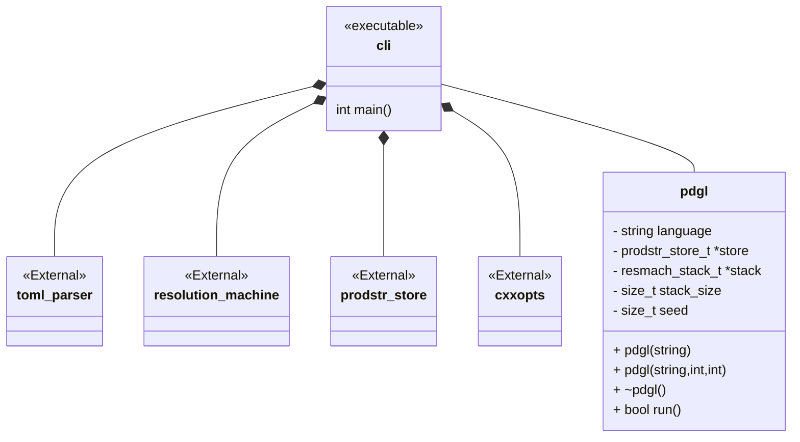
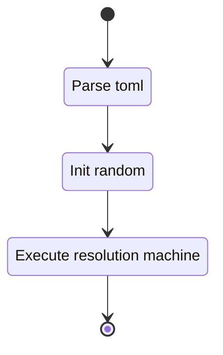
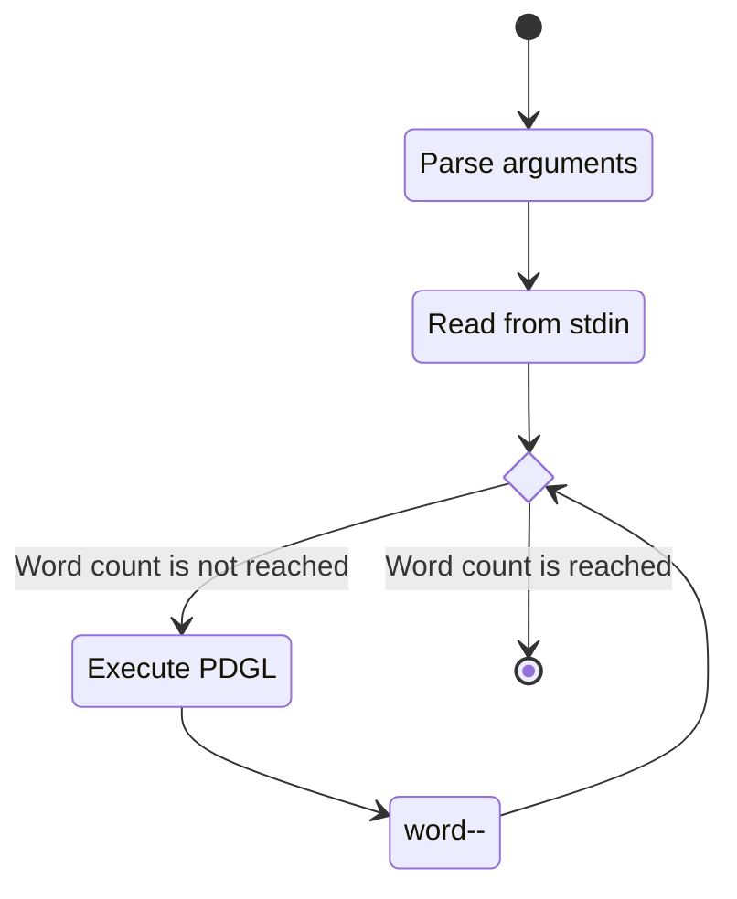

## Class Diagram



## Interfaces

None

## Libraries

- [cxxopts](https://github.com/jarro2783/cxxopts)

## Functionality

### Public Classes

#### PDGL

Container class used for producing and running a PDGL stack.

##### Public Functions

###### Constructor

The class has two constructors:

1. A constructor with three arguments for:
   - language specification
   - stack_size
   - random seed
1. A constructor with an argument for the language specification. The stack size is defaulted to
    100 and the random seed is generated in the function.

###### De-constructor

The de-constructor handles the freeing of the memory allocated in the C stack.

###### Run

The run function executes the generation of a single word of the configured language.



### Public Functions

#### Main

Main calling routine. Uses cxxopts for parsing arguments and reads file content off `stdin`.



## Validation

### Integration Test Toolchain

Integration tests are to be performed manually. This is accomplished by running the tool with the
supplied language specifications as:

```sh
cat <language> | <pdgl_cli> -c <n>
```

or with heaptrack

```sh
cat <language> | heaptrack <pdgl_cli> -c <n>
```

language specification TOML files can be found in the `language` directory or in the
`./wrappers/cli/test` directory.

### Tests

#### Positive tests

> [!test-card] "Valid configuration"
>
> The tool is configured for generation of 10 words.
>
> **Inputs:**
>
> - A valid configuration:
>   - The paired paren lanaguage specification
>   - 10 words
>   - Stack size is 100
> - A valid configuration:
>   - The paired paren lanaguage specification
>   - 10 words
>   - Stack size is 1
>
> **Expected Output:**
>
> - Output is valid

#### Negative tests

> [!test-card] "Detect memory leaks"
>
> The tool is configured for generation of 100000 words. Execution is profiled by heaptrack.
>
> **Inputs:**
>
> - A valid configuration:
>   - The paired paren lanaguage specification
>   - 100000 words
>
> **Expected Output:**
>
> - No memory leaks detected in heaptrack
>
> [!test-card] "Invalid language configured"
>
> The tool is configured for generation of 10 word but with Invalid language specification.
>
> **Inputs:**
>
> - An invalid language specification is configured.
>
> **Expected Output:**
>
> - Error in toml is reported.
