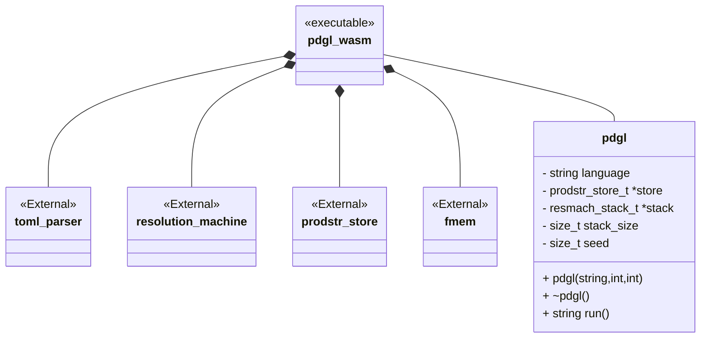
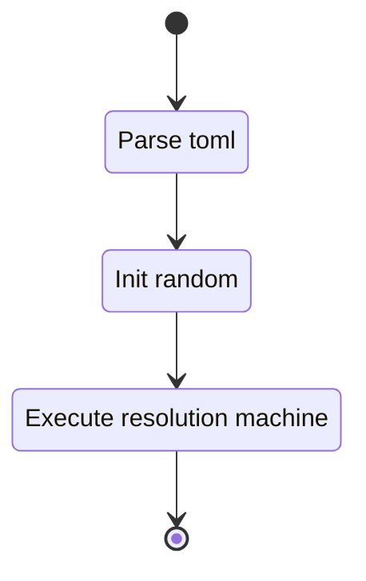

## Class Diagram



## Interfaces

None

## Libraries

- [fmem](https://github.com/NateBrune/fmem)

## Functionality

### Public Classes

#### PDGL

Container class used for producing and running a PDGL stack.

##### Public Functions

###### Constructor

The class has a single constructor with three arguments for:

- language specification
- stack_size
- random seed

###### Deconstructor

The deconstructor handles the freeing of the memory allocated in the C stack.

###### Run

The run function executes the generation of a single word of the configured language.



## Validation

### Integration Test Toolchain

Integration tests are to be performed manually. Tests are specified in a JSON array in
`./wrappers/wasm/test/tests.json`. Test specifications adhere to the
[defined test schema][#test-schema]. Tests can be run by:

1. Building the WASM tool `just build_em`
1. Launching a local web server `just launch_em_server`
1. Then navigating to a local web server `http://localhost:1313`

When the webpage loads the tests will run automatically and report positive results as:

```
n. <test name> 
```

Failures will report results as:

```
n. <test name> 
```

with detailed failure results:

1. The language specification used
1. The stack size used
1. A table with rows
    1. Seed
    1. Expected output
    1. Actual output

!!! note "Note:"

    The build and launch steps are bundled in the command:

    ```sh
    just test_em
    ```

[](){#test-schema}
#### Test Schema

```json
{
  "$schema": "https://json-schema.org/draft/2020-12/schema",
  "title": "PDGL Browser WASM test schema",
  "type": "array",
  "items": {
    "type": "object",
    "properties": {
      "name": {
        "type": "string"
      },
      "lang": {
        "type": "string"
      },
      "stack_size": {
        "type": "number"
      },
      "seeds": {
        "type": "array",
        "items": {
          "type": "number"
        }
      },
      "output": {
        "type": "array",
        "items": {
          "type": "string"
        }
      }
    },
    "required": [
      "name",
      "lang",
      "stack_size",
      "seeds",
      "output"
    ]
  }
}
```

### Positive tests

!!! test-card "Valid configurations"

    The tool is configured for generation of 10 words.

    **Inputs:**

    - A valid configuration:
        - The paired paren lanaguage specification
        - 10 words
        - Stack size is 100
    - A valid configuration:
        - The paired paren lanaguage specification
        - 10 words
        - Stack size is 1
    - A valid configuration:
        - The paired paren lanaguage specification with `%{parent set}` as a range production
        - 10 words
        - Stack size is 100
    - A valid configuration:
        - The paired paren lanaguage specification with `%{parent set}` as a range production
        - 10 words
        - Stack size is 1
    - A valid configuration:
        - The paired paren lanaguage specification with `%{parent set}` as a janet production
        - 10 words
        - Stack size is 100
    - A valid configuration:
        - The paired paren lanaguage specification with `%{parent set}` as a janet production
        - 10 words
        - Stack size is 1

    **Expected Output:**

    - Output is valid and expected for supplied seeds

### Negative tests

!!! test-card "Malformed TOML"

    The tool is configured for generation with malformed language specification.

    **Inputs:**

    - A malformed valid configuration

    **Expected Output:**

    Tool yields and error

!!! test-card "Invalid language configured"

    The tool is configured for generation of 10 word but with Invalid language specification.

    **Inputs:**

    - An invalid language specification is configured.

    **Expected Output:**

    - Error in toml is reported.
